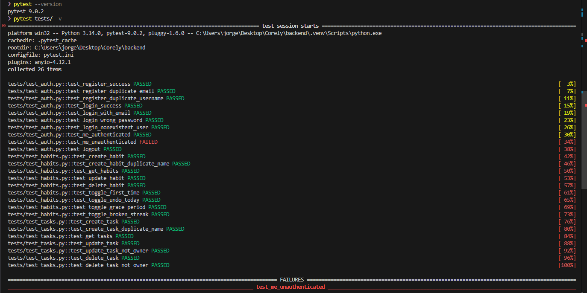
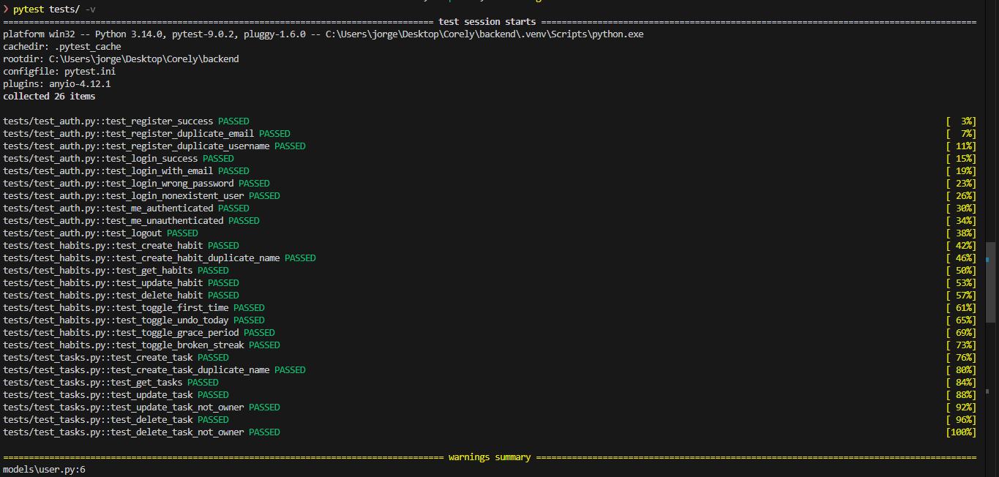
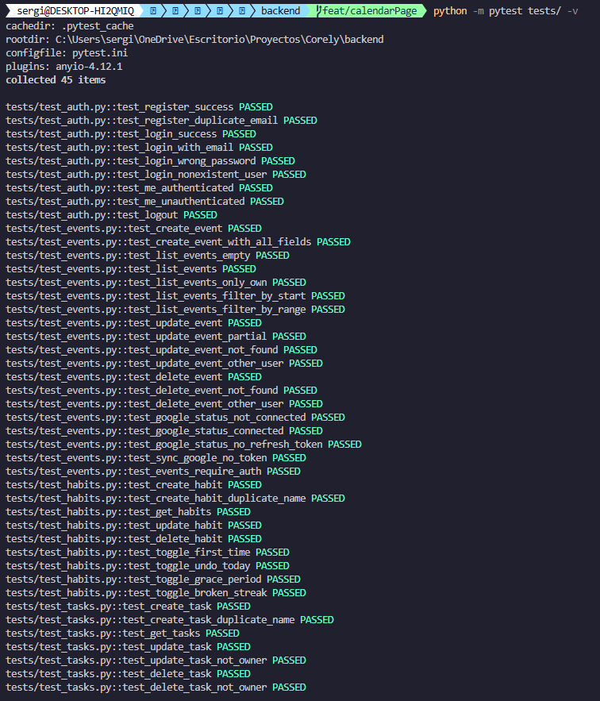
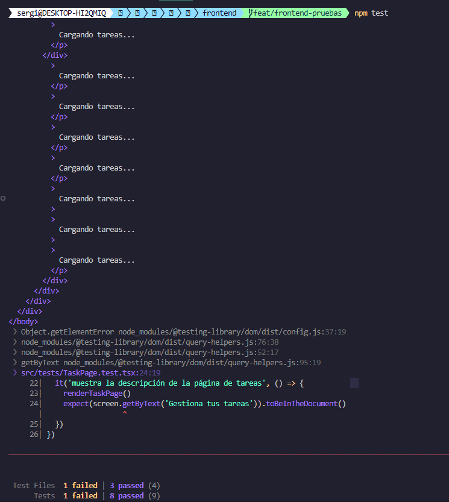
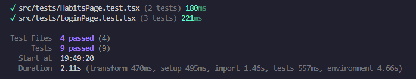
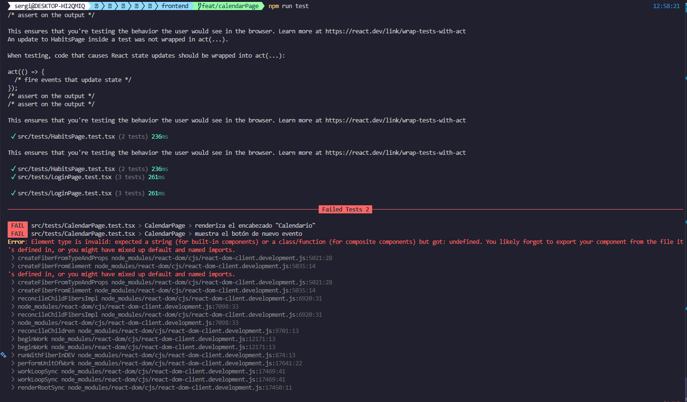
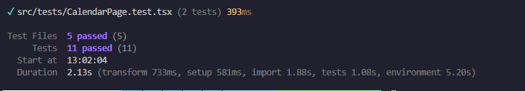

# Pruebas de la Aplicación Corely

Este documento recoge las pruebas realizadas sobre los distintos módulos de la aplicación a lo largo del desarrollo. Por cada módulo se muestra el resultado de la ejecución, incluyendo los fallos detectados y su posterior corrección.

---

## Backend

Las pruebas del backend se han implementado con **pytest 9.0.2** y cubren los módulos de autenticación, tareas y hábitos. Se utilizó SQLite en memoria como base de datos de prueba, lo que permite ejecutarlas sin necesidad de tener el servidor de base de datos activo.

### Primera ejecución — fallo detectado

| Campo         | Valor                              |
| ------------- | ---------------------------------- |
| **Fecha**     | 23 de marzo de 2026                |
| **Resultado** | ❌ 1 fallo — 25 pasadas, 1 fallida |
| **Duración**  | 5,12 segundos                      |

Durante la primera ejecución se detectó un fallo en la prueba `test_me_unauthenticated`. El test comprobaba que al acceder a `GET /auth/me` sin token se devolvía un código **403 Forbidden**, pero la versión instalada de Starlette devuelve **401 Unauthorized** cuando el esquema `HTTPBearer` no recibe credenciales.

```
FAILED tests/test_auth.py::test_me_unauthenticated
AssertionError: assert 401 == 403
```



**Corrección aplicada:** se actualizó el test para esperar el código 401, que es el comportamiento real y correcto del endpoint.

---

### Segunda ejecución — resultado final

| Campo         | Valor                           |
| ------------- | ------------------------------- |
| **Fecha**     | 23 de marzo de 2026             |
| **Resultado** | ✅ Éxito — 26 pasadas, 0 fallos |
| **Duración**  | 4,85 segundos                   |

Tras aplicar la corrección, todas las pruebas pasan satisfactoriamente.



---

### Desglose de pruebas

#### Autenticación (10 pruebas)

| Prueba                             | Descripción                                            | Estado    |
| ---------------------------------- | ------------------------------------------------------ | --------- |
| `test_register_success`            | Registro exitoso devuelve 201 con email y username     | ✅ PASSED |
| `test_register_duplicate_email`    | Email ya registrado devuelve 400                       | ✅ PASSED |
| `test_register_duplicate_username` | Username ya registrado devuelve 400                    | ✅ PASSED |
| `test_login_success`               | Login correcto devuelve token JWT                      | ✅ PASSED |
| `test_login_with_email`            | El campo username acepta también el email              | ✅ PASSED |
| `test_login_wrong_password`        | Contraseña incorrecta devuelve 401                     | ✅ PASSED |
| `test_login_nonexistent_user`      | Usuario inexistente devuelve 401                       | ✅ PASSED |
| `test_me_authenticated`            | `/auth/me` con token válido devuelve datos del usuario | ✅ PASSED |
| `test_me_unauthenticated`          | `/auth/me` sin token devuelve 401                      | ✅ PASSED |
| `test_logout`                      | Logout devuelve 200                                    | ✅ PASSED |

#### Tareas (7 pruebas)

| Prueba                            | Descripción                                             | Estado    |
| --------------------------------- | ------------------------------------------------------- | --------- |
| `test_create_task`                | Crear tarea devuelve 201 con los campos correctos       | ✅ PASSED |
| `test_create_task_duplicate_name` | Nombre duplicado por usuario devuelve 400               | ✅ PASSED |
| `test_get_tasks`                  | Listar tareas devuelve solo las del usuario autenticado | ✅ PASSED |
| `test_update_task`                | Actualizar tarea modifica los campos correctamente      | ✅ PASSED |
| `test_update_task_not_owner`      | Editar tarea ajena devuelve 404                         | ✅ PASSED |
| `test_delete_task`                | Eliminar tarea devuelve 204                             | ✅ PASSED |
| `test_delete_task_not_owner`      | Eliminar tarea ajena devuelve 404                       | ✅ PASSED |

#### Hábitos (9 pruebas)

| Prueba                             | Descripción                                         | Estado    |
| ---------------------------------- | --------------------------------------------------- | --------- |
| `test_create_habit`                | Crear hábito devuelve 201 con streak inicial = 0    | ✅ PASSED |
| `test_create_habit_duplicate_name` | Nombre duplicado por usuario devuelve 400           | ✅ PASSED |
| `test_get_habits`                  | Listar hábitos devuelve la lista del usuario        | ✅ PASSED |
| `test_update_habit`                | Actualizar hábito modifica los campos correctamente | ✅ PASSED |
| `test_delete_habit`                | Eliminar hábito devuelve 204                        | ✅ PASSED |
| `test_toggle_first_time`           | Primer toggle establece streak = 1                  | ✅ PASSED |
| `test_toggle_undo_today`           | Desmarcar el mismo día reduce el streak             | ✅ PASSED |
| `test_toggle_grace_period`         | Saltar un día no rompe la racha (período de gracia) | ✅ PASSED |
| `test_toggle_broken_streak`        | Superar el período de gracia reinicia el streak a 1 | ✅ PASSED |

### Tercera ejecución — suite completa del backend

| Campo         | Valor                           |
| ------------- | ------------------------------- |
| **Fecha**     | 2 de abril de 2026              |
| **Resultado** | ✅ Éxito — 45 pasadas, 0 fallos |
| **Duración**  | 10,39 segundos                  |

Tras implementar el módulo de eventos y Google Calendar, se ejecutó la suite completa del backend, que ahora incluye también las pruebas del módulo de eventos. Todas las pruebas pasan satisfactoriamente.



---

### Advertencias del sistema (_warnings_)

Durante la ejecución de las pruebas aparecen una serie de _warnings_ que no provocan ningún fallo pero que conviene mencionar. Son avisos de deprecación generados por las propias dependencias del proyecto:

- **SQLAlchemy** informa de que `declarative_base()` ha sido movido a `sqlalchemy.orm` en la versión 2.0, y de que `datetime.utcnow()` quedará obsoleto en favor de objetos con zona horaria explícita.
- **Pydantic** informa de que la sintaxis `class Config` para configurar modelos ha sido reemplazada por `model_config = ConfigDict(...)` en la versión 2.0.

Estos avisos no afectan al funcionamiento de la aplicación ni al resultado de las pruebas. Corresponden a patrones de código válidos en las versiones anteriores de las librerías que siguen siendo compatibles en las versiones actuales, y su corrección queda fuera del alcance de este proyecto.

---

## Frontend

Las pruebas del frontend se han implementado con **Vitest 4** y **Testing Library** (React), tecnología estándar para proyectos Vite, y cubren los módulos de autenticación (login y registro), tareas y hábitos. Se utilizó un entorno **jsdom** que simula el DOM del navegador sin necesidad de levantarlo, y las llamadas a la API se neutralizaron mediante un mock global de `fetch`.

### Primera ejecución — fallo detectado

| Campo         | Valor                             |
| ------------- | --------------------------------- |
| **Fecha**     | 23 de marzo de 2026               |
| **Resultado** | ❌ 1 fallo — 8 pasadas, 1 fallida |
| **Duración**  | ~3 segundos                       |

Durante la primera ejecución se detectó un fallo en la prueba `muestra la descripción de la página de tareas` dentro de `TaskPage.test.tsx`. El test intentaba localizar el elemento con el texto `"Gestiona tus tareas"`, pero `getByText` de Testing Library aplica coincidencia exacta por defecto. El texto real del párrafo es `"Gestiona tus tareas y mantente organizado"`, por lo que la búsqueda no encuentra ningún elemento y el test falla.

```
Error: Unable to find an element with the text: Gestiona tus tareas.
This could be because the text is broken up by multiple elements. In this case, you can provide a custom normalizer to getByText. Alternatively, use: getAllByText, queryAllByText, findAllByText.
```



**Corrección aplicada:** se actualizó el test para buscar el texto completo del párrafo: `"Gestiona tus tareas y mantente organizado"`, que es la cadena exacta presente en el componente.

---

### Segunda ejecución — resultado final

| Campo         | Valor                          |
| ------------- | ------------------------------ |
| **Fecha**     | 23 de marzo de 2026            |
| **Resultado** | ✅ Éxito — 9 pasadas, 0 fallos |
| **Duración**  | ~2,11 segundos                 |

Tras aplicar la corrección, todas las pruebas pasan satisfactoriamente.



---

### Desglose de pruebas

#### Autenticación — Login (3 pruebas)

| Prueba                                 | Descripción                                                 | Estado    |
| -------------------------------------- | ----------------------------------------------------------- | --------- |
| `renderiza sin errores`                | El formulario de login se monta sin lanzar excepciones      | ✅ PASSED |
| `muestra el botón de inicio de sesión` | El botón de submit "Iniciar sesión" está presente en el DOM | ✅ PASSED |
| `muestra el enlace para crear cuenta`  | El enlace "Crear cuenta" apunta a la ruta /signup           | ✅ PASSED |

#### Autenticación — Registro (2 pruebas)

| Prueba                                | Descripción                                               | Estado    |
| ------------------------------------- | --------------------------------------------------------- | --------- |
| `renderiza sin errores`               | El formulario de registro se monta sin lanzar excepciones | ✅ PASSED |
| `muestra el campo de nombre completo` | El campo asociado al label "Nombre completo" es accesible | ✅ PASSED |

#### Tareas (2 pruebas)

| Prueba                                          | Descripción                                                     | Estado    |
| ----------------------------------------------- | --------------------------------------------------------------- | --------- |
| `renderiza el encabezado "Tareas"`              | El título principal de la página de tareas es visible al montar | ✅ PASSED |
| `muestra la descripción de la página de tareas` | El subtítulo descriptivo está presente en pantalla              | ✅ PASSED |

#### Hábitos (2 pruebas)

| Prueba                              | Descripción                                            | Estado    |
| ----------------------------------- | ------------------------------------------------------ | --------- |
| `renderiza el encabezado "Hábitos"` | El título de la página de hábitos es visible al montar | ✅ PASSED |
| `muestra el botón de nuevo hábito`  | El botón "Nuevo Hábito" está presente en la interfaz   | ✅ PASSED |

### Tercera ejecución — fallo detectado

| Campo         | Valor                              |
| ------------- | ---------------------------------- |
| **Fecha**     | 2 de abril de 2026                 |
| **Resultado** | ❌ 1 fallo — 9 pasadas, 2 fallidas |
| **Duración**  | ~3,12 segundos                     |

Se añadieron tests para el módulo de calendario (`CalendarPage.test.tsx`). Durante la primera ejecución ambos tests fallaron debido a un import incorrecto: se usó `import CalendarPage from ...` (export por defecto) cuando el componente usa un named export (`export const CalendarPage`).

```
Error: Element type is invalid: expected a string (for built-in components) or a class/function
(for composite components) but got: undefined. You likely forgot to export your component
from the file it's defined in, or you might have mixed up default and named imports.
```



**Corrección aplicada:** se actualizó el import a `import { CalendarPage } from ...` para usar el named export correcto.

---

### Cuarta ejecución — resultado final

| Campo         | Valor                           |
| ------------- | ------------------------------- |
| **Fecha**     | 2 de abril de 2026              |
| **Resultado** | ✅ Éxito — 11 pasadas, 0 fallos |
| **Duración**  | ~3,12 segundos                  |

Tras corregir el import, todos los tests del frontend pasan satisfactoriamente, incluyendo los dos nuevos del módulo de calendario.



---

### Notas sobre la configuración de pruebas

Las pruebas requirieron un mock del módulo `@react-oauth/google` porque `useGoogleLogin` intenta acceder a la API de Google en tiempo de inicialización, lo cual no está disponible en el entorno jsdom. Asimismo, `fetch` se neutralizó globalmente en el fichero `setupTests.ts` para evitar llamadas reales a la API durante los tests. Ambas técnicas son estándar en el ecosistema de Testing Library y no afectan al funcionamiento de la aplicación en producción.

---

## Resumen global

| Módulo    | Pruebas | Pasadas | Fallidas |
| --------- | ------- | ------- | -------- |
| Backend   | 45      | 45      | 0        |
| Frontend  | 11      | 11      | 0        |
| **Total** | **56**  | **56**  | **0**    |
